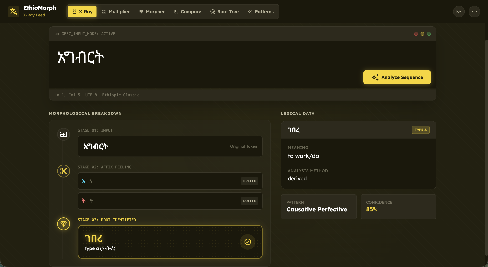
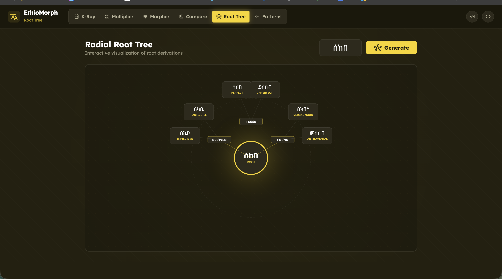
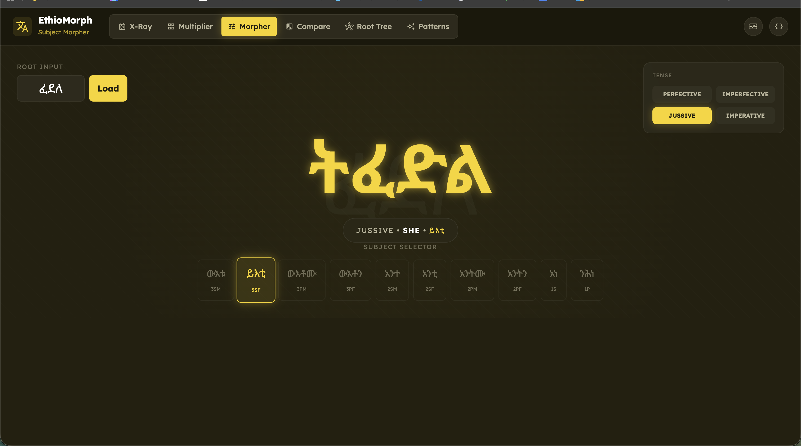
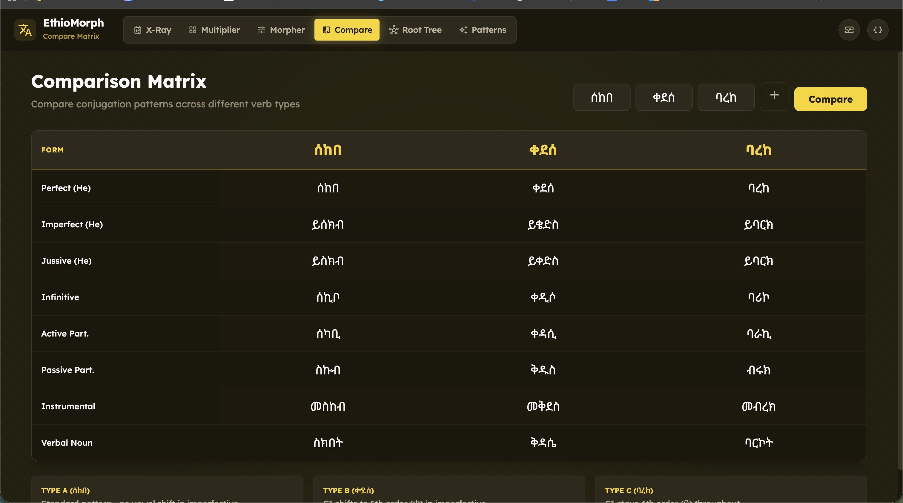

# EthioMorph

Ge'ez Morphological Analysis and Generation Engine

**Live:** https://ethiomorph.esubalew.et

**Note:** This is a work-in-progress. Expect bugs and incomplete features.

---

## Why This Works

Ge'ez is a rule-based language. Unlike English where word formation is irregular, Ge'ez follows strict patterns. Every conjugation can be computed from a root using simple transformations.

A root like **ቀተለ** (q-t-l) always produces **ይቀትል** in imperfective. The rule:
- Take radicals: ቀ, ተ, ለ
- Apply vowel orders: C1(1st), C2(6th), C3(6th)
- Add prefix: ይ
- Result: ይቅትል

Because Ethiopic Unicode assigns consecutive codepoints to vowel forms (ቀ, ቁ, ቂ, ቃ...), changing a vowel is arithmetic:

```
new_char = base_char + (target_order - 1)
```

This makes Ge'ez morphology computable without dictionaries or machine learning.

---

## Screenshots

### X-Ray Analysis
Breaks down any word into root + affixes.



### Root Tree
Visual map of all forms derived from a root.



### Morpher
Interactive conjugation by tense and subject.



### Compare Matrix
Side-by-side comparison of verb types.



---

## Supported Verb Types

| Type | Example | Description |
|------|---------|-------------|
| ቀተለ | Type A | Strong triradical |
| ቀደሰ | Type B | Geminate |
| ባረከ | Type C | Long vowel |
| ጦመረ | Type C-O | O-initial |
| ሴሰየ | Weak | Weak final |
| ክህለ | Laryngeal | Laryngeal consonant |
| ማሕረከ | Quad | Quadriliteral |
| ተንበለ | T-Quad | Prefixed quadriliteral |

## Stems

| Stem | Prefix | Example |
|------|--------|---------|
| Basic | — | ቀተለ |
| Passive | ተ- | ተቀተለ |
| Causative | አ- | አቀተለ |
| Causative-Passive | አስተ- | አስተቀተለ |
| Reciprocal | ተ- | ተቃታለ |

## API

| Endpoint | Description |
|----------|-------------|
| `/api/analyze?word=...` | Analyze a word |
| `/api/expand?root=...` | Generate conjugations |

## Paper

Technical documentation in `paper/`:
- `ethiomorph_paper.pdf` - Full writeup
- `ethiomorph_paper.tex` - LaTeX source

---

MIT License

Esubalew Chekol, Addis Ababa University
